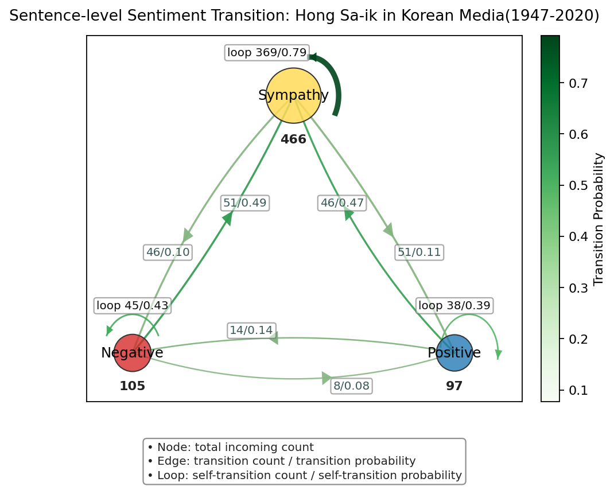
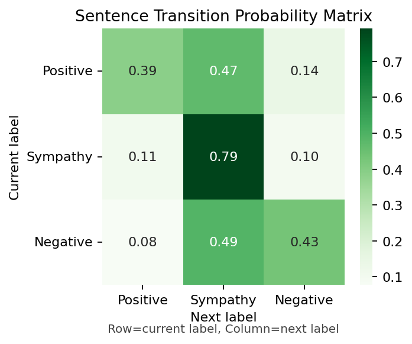

# Purpose

- Sentiment analysis of sentences in articles related to Hong Sa-ik, who is a Korean WWII historical figure, in major Korean media outlets

## Output

### Sentiment Transition Network



### Sentiment Transition Matrix



# How to Run

- Python 3.12 must be installed. (Python 3.10+ recommended)
- Enter the following commands in the terminal in order.

## 1. Preparation: Virtual Environment & Install Packages

- python -m venv .venv
- source .venv/bin/activate (On Windows: .venv\Scripts\activate)
- pip install -r requirements.txt

## 2. Preprocessing

- python -m src.preprocess.clean_text

## 3. Analysis 1: Generate Sentence-level Sentiment Labeling CSV

- python -m src.analysis.contextual_sentence_sentiment --method zero-shot --zero-shot-labels "긍정,부정,동정"
- output: results/contextual_sentence_flow.csv

## 4. Analysis 2: Generate Sentence-level Sentiment Transition CSV

- python -m src.analysis.contextual_sentence_transition_network
- output: results/network_context_sentence/sentiment_transition_edges.csv, sentiment_transition_nodes.csv

## 5. Visualization

- python -c "from src.visualize.sentence_transition_network import plot_contextual_sentence_transition_network; plot_contextual_sentence_transition_network()"
- Output: results/plots_network_context_sentence/sentence_transition_network.png

## Project Structure

```
.venv/　→ Python virtual environment
data/　
	processed/
		articles_processed.csv
	raw/
		articles_raw.csv

results/　→ Output results
	network_context_sentence/
		sentiment_transition_edges.csv
		sentiment_transition_nodes.csv
	plots_network_context_sentence/
		sentence_transition_network.png
	contextual_sentence_flow.csv

src/　→ Source code
	main.py
	analysis/
		contextual_sentence_sentiment.py
		contextual_sentence_transition_network.py
	preprocess/
		clean_text.py
		stopwords_util.py
	visualize/
		plot_sentiment.py
		sentence_transition_network.py

README.md　→ Project documentation
requirements.txt　→ Python dependencies
run_pipeline.sh　→ Pipeline script
```
